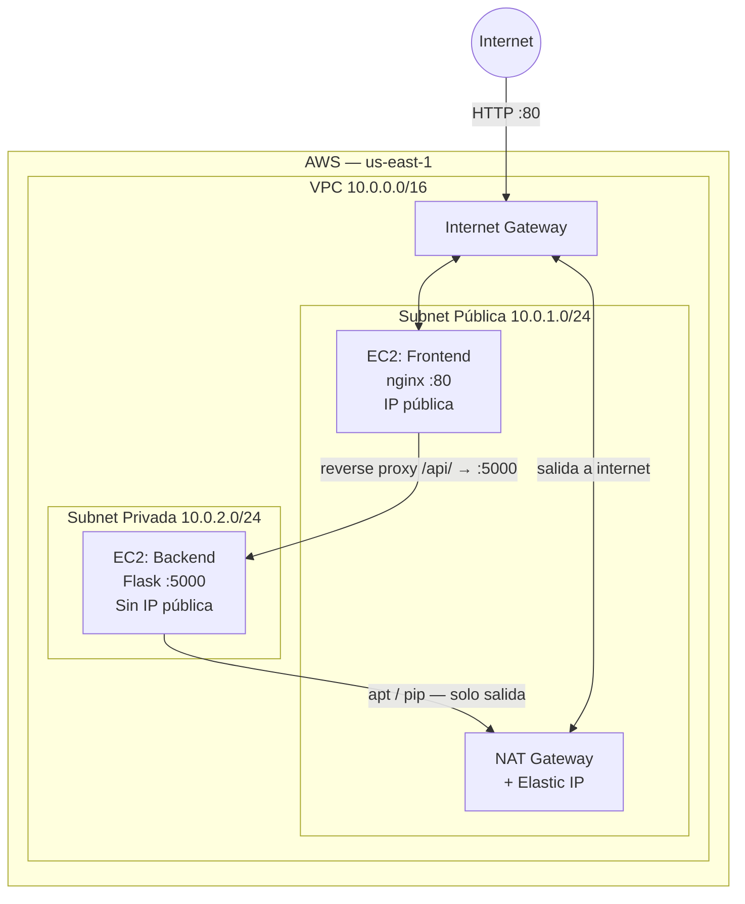
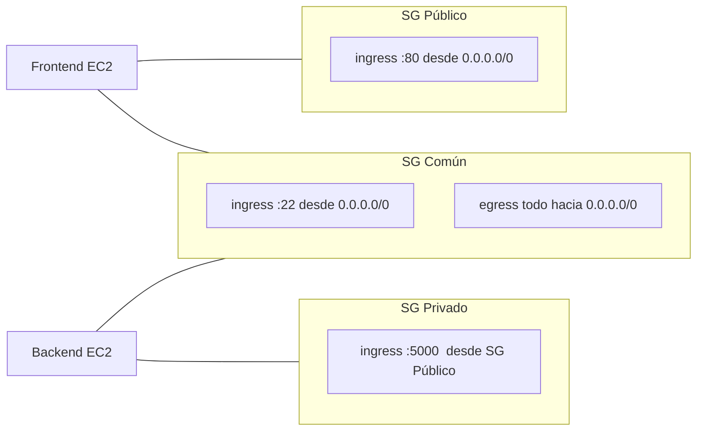
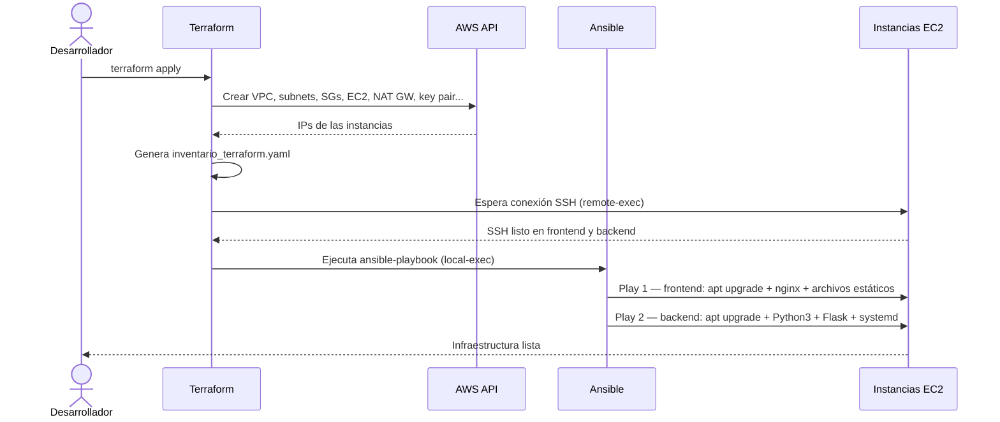
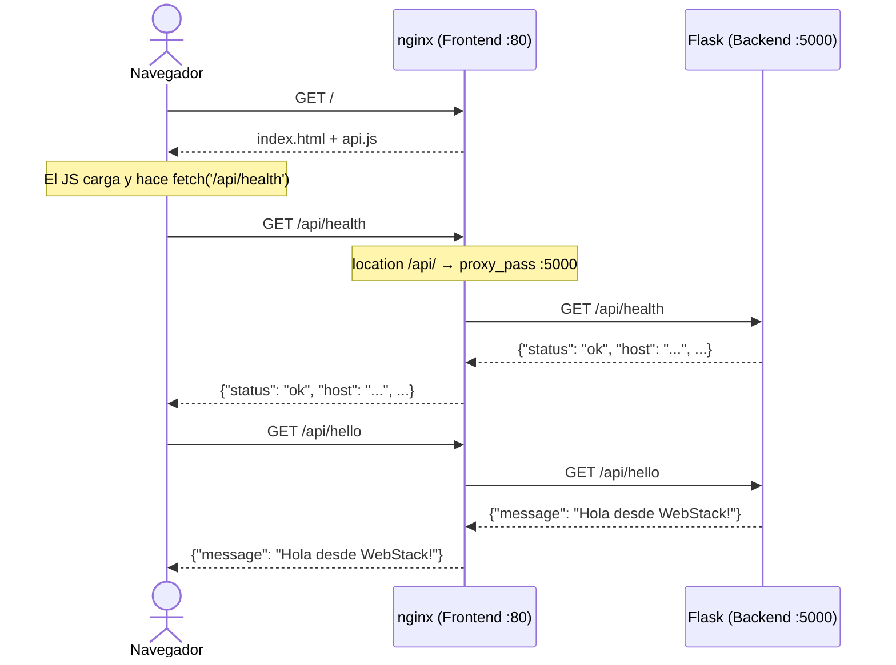

# Taller de Infraestructura como Código — BootcampPeru

Proyecto práctico que despliega una aplicación web de dos capas (frontend + backend) en AWS usando **Terraform** para la infraestructura y **Ansible** para el aprovisionamiento de las instancias.

La arquitectura refleja patrones usados en producción: subnet privada para el backend, acceso SSH mediante bastion host, y comunicación inter-servicio restringida por security groups.

---

## Contenidos

- [Arquitectura](#arquitectura)
- [Tecnologías](#tecnologías)
- [Estructura del proyecto](#estructura-del-proyecto)
- [Cómo funciona](#cómo-funciona)
- [Requisitos previos](#requisitos-previos)
- [Instalación de herramientas](#instalación-de-herramientas)
- [Despliegue](#despliegue)
- [Verificación](#verificación)
- [Conexión SSH](#conexión-ssh)
- [Variables configurables](#variables-configurables)
- [Destruir la infraestructura](#destruir-la-infraestructura)

---

## Arquitectura

### Topología de red



El backend vive en una **subnet privada**: no tiene IP pública y no es alcanzable directamente desde internet. Todo el tráfico de la API entra por el frontend (nginx), que actúa como reverse proxy hacia la IP privada del backend.

El backend sí necesita acceso a internet de salida para instalar paquetes. Ese tráfico sale a través del **NAT Gateway**: una puerta de salida unidireccional que no permite conexiones entrantes iniciadas desde fuera.

### Security groups



Los tres security groups separan responsabilidades:

- **Público**: expone el puerto 80 a internet. Solo el frontend lo tiene.
- **Privado**: permite el puerto 5000 *únicamente desde instancias que tengan el SG público*. Esta referencia SG-a-SG es más robusta que un CIDR: si el frontend cambia de IP la regla sigue siendo válida.
- **Común**: SSH y egress, aplicado a ambas instancias. Centralizar estas reglas evita duplicación.

### Pipeline de despliegue



Terraform no solo crea la infraestructura: también genera el inventario de Ansible y dispara el playbook al final del `apply`. La coordinación entre ambas herramientas ocurre en `aprovisionamiento.tf`.

### Flujo de una petición HTTP



El navegador nunca habla directamente con el backend. Las llamadas `fetch('/api/...')` van al frontend (misma IP, mismo puerto), que las redirige internamente. Este patrón se llama **reverse proxy**: el cliente desconoce la existencia del servidor de aplicaciones.

---

## Tecnologías

### Terraform

Terraform es la herramienta de **Infraestructura como Código (IaC)**: describes el estado deseado de la infraestructura en archivos `.tf` y Terraform se encarga de crearlo, actualizarlo o destruirlo en el proveedor cloud. En lugar de hacer clic en la consola de AWS, el estado de la infraestructura queda en archivos versionables en Git.

Conceptos usados en este proyecto:

| Concepto | Archivo | Para qué se usa |
|---|---|---|
| `resource` | todos los `.tf` | Declara un recurso a crear (VPC, EC2, SG...) |
| `variable` | `variables.tf` | Parámetros de entrada del módulo |
| `output` | `salidas.tf` | Valores exportados tras el apply (IPs, comandos SSH) |
| `data` | `computo.tf` | Consulta datos externos (AMI de Ubuntu más reciente) |
| `locals` | `aprovisionamiento.tf` | Variables internas del módulo |
| `provisioner` | `aprovisionamiento.tf` | Acciones post-creación (esperar SSH, ejecutar Ansible) |
| `backend s3` | `proveedores.tf` | Estado remoto: el `.tfstate` vive en S3, no en disco local |

El **estado remoto en S3** es fundamental en equipos: un único archivo `.tfstate` compartido garantiza que todos ven la misma infraestructura. La opción `use_lockfile = true` crea un lock durante el apply para evitar modificaciones concurrentes.

### Ansible

Ansible es la herramienta de **gestión de configuración**: una vez que las instancias existen, Ansible se conecta por SSH y ejecuta las tareas necesarias para dejarlas configuradas.

La diferencia con Terraform es de ámbito: Terraform *crea y gestiona recursos en AWS*; Ansible *configura lo que corre dentro de cada instancia*.

Conceptos usados en este proyecto:

| Concepto | Archivo | Para qué se usa |
|---|---|---|
| `playbook` | `playbook.yaml` | Punto de entrada: qué roles se aplican a qué hosts |
| `inventory` | `inventario_terraform.yaml` | Lista de hosts con IPs y opciones de conexión SSH |
| `role` | `roles/` | Unidad reutilizable: agrupa tareas, templates y variables |
| `task` | `roles/*/tasks/main.yml` | Acción concreta (instalar paquete, copiar archivo, etc.) |
| `template` | `roles/*/templates/*.j2` | Archivos de configuración con variables Jinja2 |
| `handler` | `roles/*/handlers/main.yml` | Acción que se ejecuta solo cuando una tarea notifica un cambio |
| `vars` / `defaults` | `roles/*/vars/`, `defaults/` | Variables del rol (`vars` tiene mayor precedencia que `defaults`) |

El inventario de este proyecto es **generado automáticamente por Terraform**: incluye las IPs reales de las instancias y configura el `ProxyJump` para que Ansible acceda al backend a través del frontend. El backend nunca necesita IP pública.

---

## Estructura del proyecto

```
taller/
├── terraform/
│   ├── proveedores.tf        # Provider AWS, versiones de providers y backend S3 (estado remoto)
│   ├── variables.tf          # Variables de entrada con tipos, defaults y validaciones
│   ├── terraform.tfvars      # Valores concretos para las variables
│   ├── redes.tf              # VPC, subnets, IGW, NAT gateway y route tables
│   ├── seguridad.tf          # Tres security groups: público, privado y común
│   ├── computo.tf            # Instancias EC2 y consulta de AMI Ubuntu
│   ├── ssh.tf                # Par de llaves RSA generado por Terraform
│   ├── aprovisionamiento.tf  # Inventario Ansible + provisioners + ejecución del playbook
│   └── salidas.tf            # Outputs: IPs, IDs de recursos y comandos SSH listos para usar
│
└── ansible/
    ├── playbook.yaml                        # Playbook principal: dos plays (frontend y backend)
    ├── inventario_terraform.yaml            # Generado por Terraform — no editar manualmente
    ├── inventario_terraform.ejemplo.yaml    # Muestra la estructura del inventario generado
    └── roles/
        ├── comun/     # apt upgrade — primer rol en ejecutarse en ambas instancias
        ├── frontend/  # nginx, archivos estáticos (index.html, api.js) y reverse proxy
        └── backend/   # Python3, Flask, app.py y servicio systemd
```

---

## Cómo funciona

### 1. Terraform crea la infraestructura

Al ejecutar `terraform apply`, Terraform lee todos los archivos `.tf` y construye un grafo de dependencias entre recursos. Los crea en el orden correcto: primero la VPC, luego las subnets que la necesitan, luego las instancias que necesitan las subnets, y así sucesivamente.

Al terminar de crear los recursos de AWS, dos `provisioner` en `aprovisionamiento.tf` coordinan el traspaso a Ansible:
1. Un `remote-exec` verifica que SSH está activo en ambas instancias (útil para esperar el cloud-init inicial).
2. Un `local-exec` ejecuta `ansible-playbook` desde tu máquina local, pasando el inventario y la IP privada del backend como variable extra.

### 2. Ansible configura las instancias

El playbook tiene dos **plays** independientes: uno para el grupo `frontend` y otro para `backend`. Cada play aplica primero el rol `comun` (actualización del SO) y luego el rol específico del servicio.

El inventario generado por Terraform configura el acceso al backend con `ProxyJump`: Ansible se conecta primero al frontend y desde ahí salta al backend sin que este necesite IP pública.

### 3. Los servicios quedan activos

Flask corre como un **servicio systemd** (`flask-app.service`), lo que garantiza que se reinicia automáticamente si el proceso falla o si la instancia se reinicia. nginx arranca automáticamente al inicio por defecto en Ubuntu.

El rol `frontend` deshabilita el sitio `default` de nginx y activa la configuración del proyecto mediante un enlace simbólico en `sites-enabled/` — el mecanismo estándar de nginx para activar y desactivar sitios.

---

## Requisitos previos

- [Terraform](https://developer.hashicorp.com/terraform/install) >= 1.0
- [Ansible](https://docs.ansible.com/ansible/latest/installation_guide/) >= 2.12
- AWS CLI configurado con credenciales válidas (`aws configure`)
- Bucket S3 para el estado remoto (ver `proveedores.tf`)

> Si aún no tienes el bucket, créalo antes del primer `terraform init`:
> ```bash
> aws s3 mb s3://bootcamperu-tf-state --region us-east-1
> ```

---

## Instalación de herramientas

Las versiones indicadas son las más recientes al momento de escribir esta guía. Verifica siempre en las fuentes oficiales si hay versiones más nuevas disponibles.

### Terraform (v1.14.8)

Fuente oficial: [developer.hashicorp.com/terraform/install](https://developer.hashicorp.com/terraform/install)

**macOS**
```bash
brew tap hashicorp/tap
brew install hashicorp/tap/terraform
```

**Linux — Ubuntu / Debian**
```bash
wget -O - https://apt.releases.hashicorp.com/gpg | sudo gpg --dearmor -o /usr/share/keyrings/hashicorp-archive-keyring.gpg
echo "deb [arch=$(dpkg --print-architecture) signed-by=/usr/share/keyrings/hashicorp-archive-keyring.gpg] https://apt.releases.hashicorp.com $(grep -oP '(?<=UBUNTU_CODENAME=).*' /etc/os-release || lsb_release -cs) main" | sudo tee /etc/apt/sources.list.d/hashicorp.list
sudo apt update && sudo apt install -y terraform
```

**Linux — RHEL / CentOS**
```bash
sudo yum install -y yum-utils
sudo yum-config-manager --add-repo https://rpm.releases.hashicorp.com/RHEL/hashicorp.repo
sudo yum -y install terraform
```

**Linux — Fedora**
```bash
sudo dnf install -y dnf-plugins-core
sudo dnf config-manager addrepo --from-repofile=https://rpm.releases.hashicorp.com/fedora/hashicorp.repo
sudo dnf -y install terraform
```

**Windows**

Descarga el binario desde la [página oficial](https://developer.hashicorp.com/terraform/install), descomprime el `.zip` y coloca `terraform.exe` en un directorio de tu `PATH`. Alternativamente con `winget` (desde PowerShell):
```powershell
winget install HashiCorp.Terraform
```

**Verificar:**
```bash
terraform -version
```

---

### Ansible (v2.20.4 — requiere Python ≥ 3.12)

Fuente oficial: [docs.ansible.com — Installation Guide](https://docs.ansible.com/ansible/latest/installation_guide/intro_installation.html)

> **Windows sin WSL no está soportado como nodo de control.** Si usas Windows, instala primero [WSL2](https://learn.microsoft.com/windows/wsl/install) con Ubuntu y sigue las instrucciones de Linux.

**macOS**
```bash
brew install ansible
```

**Linux — Ubuntu / Debian (vía PPA oficial)**
```bash
sudo apt update && sudo apt install -y software-properties-common
sudo add-apt-repository --yes --update ppa:ansible/ansible
sudo apt install -y ansible
```

**Linux — RHEL / CentOS / Fedora**
```bash
sudo dnf install -y ansible-core
```

**Todos los sistemas — pip (método universal, siempre la versión más reciente)**
```bash
pip install ansible
```

**Windows — WSL2 con Ubuntu**

Desde PowerShell como administrador, habilita WSL2 e instala Ubuntu:
```powershell
wsl --install
```
Reinicia si se solicita, abre la terminal de Ubuntu y ejecuta:
```bash
sudo apt update && sudo apt install -y ansible
```

**Verificar:**
```bash
ansible --version
```

---

### AWS CLI (v2)

Fuente oficial: [docs.aws.amazon.com/cli](https://docs.aws.amazon.com/cli/latest/userguide/getting-started-install.html)

**macOS**
```bash
curl "https://awscli.amazonaws.com/AWSCLIV2.pkg" -o "AWSCLIV2.pkg"
sudo installer -pkg AWSCLIV2.pkg -target /
rm AWSCLIV2.pkg
```

**Linux — x86_64**
```bash
curl "https://awscli.amazonaws.com/awscli-exe-linux-x86_64.zip" -o "awscliv2.zip"
unzip awscliv2.zip
sudo ./aws/install
rm -rf awscliv2.zip aws/
```

**Linux — ARM64 (aarch64)**
```bash
curl "https://awscli.amazonaws.com/awscli-exe-linux-aarch64.zip" -o "awscliv2.zip"
unzip awscliv2.zip
sudo ./aws/install
rm -rf awscliv2.zip aws/
```

**Windows**

Desde PowerShell (instalación silenciosa):
```powershell
msiexec.exe /i https://awscli.amazonaws.com/AWSCLIV2.msi /qn
```

**Verificar:**
```bash
aws --version
```

---

### Configurar credenciales de AWS

Con el CLI instalado, configura el acceso a tu cuenta. Necesitas una **Access Key** generada desde la consola de AWS en IAM → Users → Security credentials:

```bash
aws configure
```

El comando pedirá cuatro valores:

```
AWS Access Key ID:     AKIA...
AWS Secret Access Key: ****
Default region name:   us-east-1
Default output format: json
```

Las credenciales se guardan en `~/.aws/credentials`. Para verificar que el acceso funciona:

```bash
aws sts get-caller-identity
```

---

## Despliegue

### 1. Inicializar Terraform

```bash
cd terraform
terraform init
```

`terraform init` descarga los providers declarados en `proveedores.tf` (AWS, local, tls) y conecta con el backend S3 para el estado remoto. Es necesario ejecutarlo al clonar el repositorio o cuando cambias los providers.

### 2. Revisar el plan

```bash
terraform plan
```

Muestra exactamente qué recursos se crearán, modificarán o destruirán, sin aplicar ningún cambio. Úsalo siempre antes de un `apply` para detectar cambios inesperados y entender qué va a ocurrir.

### 3. Aplicar la infraestructura

```bash
terraform apply
```

Crea toda la infraestructura, genera el inventario de Ansible y ejecuta el playbook. Al terminar, muestra los outputs definidos en `salidas.tf`.

---

## Verificación

Una vez completado el `apply`, obtén la IP pública del frontend:

```bash
terraform output frontend_public_ip
```

Verifica los endpoints de la API:

```bash
curl http://<frontend_public_ip>/api/health
curl http://<frontend_public_ip>/api/hello
```

También puedes abrir `http://<frontend_public_ip>` en el navegador para ver la interfaz gráfica.

---

## Conexión SSH

**Frontend** (acceso directo vía IP pública):

```bash
terraform output -raw frontend_ssh_command | bash
```

**Backend** (a través del frontend como bastion host):

```bash
terraform output -raw backend_ssh_command | bash
```

El backend no tiene IP pública. La opción `ProxyJump` abre un túnel SSH a través del frontend de forma transparente: Terraform genera el comando completo con la forma `ssh -i llave.pem -o ProxyJump=ubuntu@<frontend_ip> ubuntu@<backend_ip>`.

---

## Variables configurables

| Variable | Predeterminado | Descripción |
|---|---|---|
| `region` | `us-east-1` | Región de AWS donde se crean los recursos |
| `vpc_cidr` | `10.0.0.0/16` | Bloque CIDR de la VPC |
| `public_subnet_cidr` | `10.0.1.0/24` | Bloque CIDR de la subnet pública |
| `private_subnet_cidr` | `10.0.2.0/24` | Bloque CIDR de la subnet privada |
| `instance_type` | `t3.small` | Tipo de instancia EC2 (opciones: t3.micro, t3.small, t3.medium) |
| `nombre_proyecto` | `taller-bootcamperu` | Prefijo para los nombres de los recursos en AWS |
| `nombre_llave_ssh` | `taller.pem` | Nombre del archivo de la llave SSH generada por Terraform |
| `usuario_ssh` | `ubuntu` | Usuario del SO en las instancias (ubuntu en AMIs de Canonical) |

Para sobreescribir un valor sin editar `terraform.tfvars`:

```bash
terraform apply -var="instance_type=t3.micro"
```

---

## Destruir la infraestructura

```bash
terraform destroy
```

> **Importante:** El NAT Gateway genera costo por hora aunque no haya tráfico. Destruye la infraestructura al terminar el taller para evitar cargos inesperados.

---

## Licencia

MIT-0
